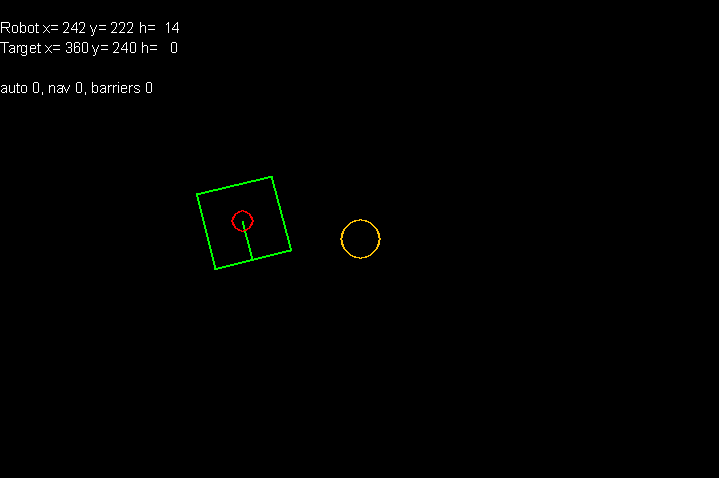
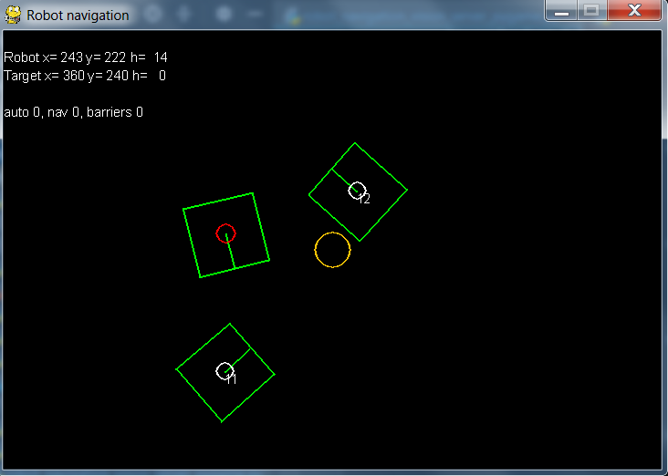
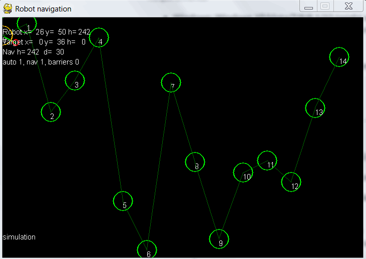

ArucoRobotNavigation
====================

Markers are pulled from ArucoAndroidServer (https://github.com/eziosoft/ArucoAndroidServer)  

Buttons:  
a - auto - enables control of the robot  
n - navigation ON  
w - add waypoint   
b - enable borders  

  
  
  
  Simulation  

  Controlling real robot (https://github.com/eziosoft/MQTT_robot_Arduino)  
